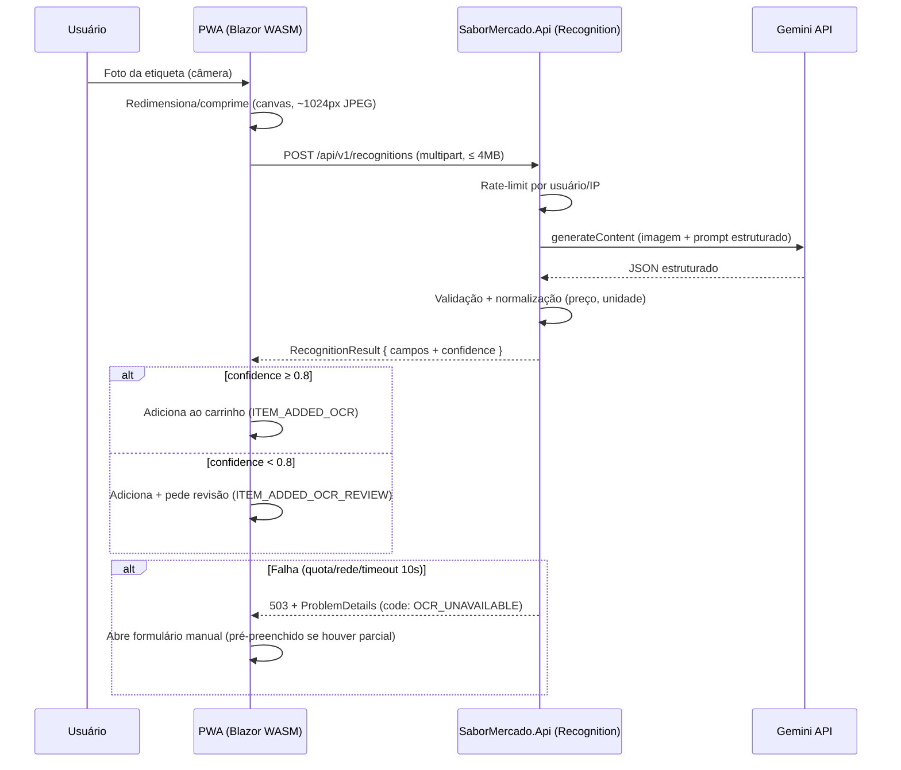

# Integração OCR — Google Gemini (free tier)

> Especificação canônica do Modo Foto Inteligente (F1). O cliente nunca chama
> o Gemini diretamente; o backend faz proxy (Constitution II).

## Fluxo



## Modelo e prompt

- **Modelo:** Gemini Flash mais recente disponível no free tier (família
  `gemini-*-flash` / `flash-lite`). O nome do modelo é **configuração**
  (`Recognition:GeminiModel` no appsettings), nunca hardcoded — o Google troca
  versões com frequência.
- **Saída estruturada:** usar `responseMimeType: application/json` +
  `responseSchema` com o shape de `RecognitionResult`:

```json
{
  "productName": "Óleo de Soja Liza",
  "brand": "Liza",
  "quantityValue": 900,
  "quantityUnit": "ml",
  "price": 8.99,
  "ean": null,
  "confidence": 0.93,
  "rawText": "ÓLEO DE SOJA LIZA 900ML R$ 8,99"
}
```

- **Prompt (resumo do contrato):** "Extraia da imagem de etiqueta de preço de
  supermercado brasileiro: nome do produto, marca, peso/volume com unidade,
  preço em reais (formato brasileiro com vírgula), código EAN se visível.
  Retorne null para campos não identificados. confidence = sua certeza global
  de 0 a 1." Texto completo versionado em
  `src/SaborMercado.Modules.Recognition/Prompts/shelf-label.txt`.

## Proteções no backend

| Proteção            | Valor inicial                  | Implementação Fase 1            |
|---------------------|--------------------------------|---------------------------------|
| Rate-limit usuário  | 10 fotos/min, 150/dia          | `RateLimiter` in-process        |
| Rate-limit global   | abaixo da quota free do Gemini, lida de config | token bucket    |
| Timeout             | 10 s                           | `HttpClient` + Polly            |
| Retry               | 1 retry com backoff (somente 5xx/timeout) | Polly             |
| Payload             | ≤ 4 MB, somente `image/jpeg|png|webp` | validação no endpoint    |
| API key             | Somente no servidor (env var `GEMINI_API_KEY`) | nunca no cliente |

Quando a quota global do dia se esgota, o endpoint responde imediatamente
`503 OCR_UNAVAILABLE` **sem chamar o Gemini** — o app cai no modo manual sem
latência extra.

## Normalização pós-OCR (no servidor)

1. Preço: aceitar `8,99` / `R$ 8,99` / `8.99` → `decimal` invariante.
2. Unidade: mapear variações (`ML`, `ml.`, `Ml`) → enum canônico
   (`g|kg|ml|l|un`).
3. Nome: trim, colapsar espaços, Title Case preservando siglas.
4. EAN: validar dígito verificador; inválido → `null`.

## Fallback manual (obrigatório)

O formulário manual é o mesmo componente usado no CRUD do catálogo pessoal:
- Sempre acessível pelo botão "Digitar manualmente" na tela da câmera.
- Em falha do OCR, abre automaticamente, pré-preenchido com qualquer campo
  parcial retornado.
- Telemetria: toda falha registra `RecognitionLog` (motivo, latência) para
  acompanhar a taxa de sucesso (meta: ≥ 70% sem edição manual).
