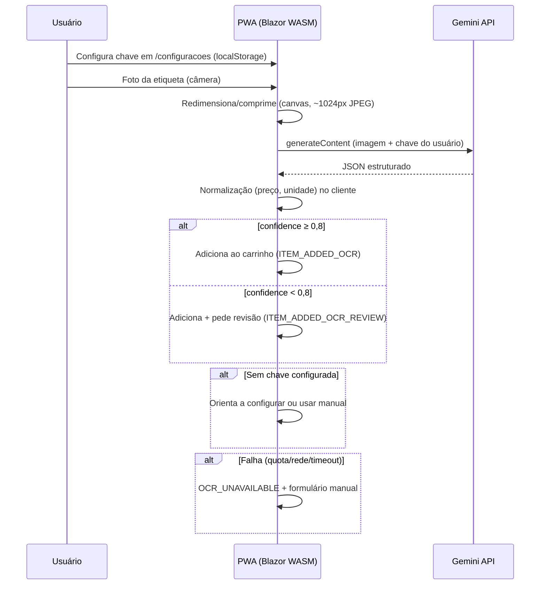

# Integração OCR — Google Gemini (free tier)

> Especificação canônica do Modo Foto Inteligente (F1). Cada usuário usa **sua
> própria chave** Gemini, armazenada em **localStorage** no dispositivo
> (Constitution II). O PWA chama o Google **diretamente**; nosso backend não
> recebe a chave nem é pré-requisito para OCR.

## Fluxo



## Chave do usuário (localStorage)

| Aspecto | Regra |
|---------|--------|
| Onde | `localStorage` — chave `saborMercado.preferences.geminiApiKey` |
| Quem fornece | O próprio usuário (free tier em [Google AI Studio](https://aistudio.google.com/apikey)) |
| Backend | **Nunca** recebe nem persiste a chave |
| Sem chave | Modo foto bloqueado; cadastro manual continua disponível |
| UI | `/configuracoes` — campo tipo password, salvar/remover |

## Modelo e prompt

- **Modelo:** configurável em `wwwroot/appsettings.json` (`GeminiModel`, default
  `gemini-2.0-flash`).
- **Saída estruturada:** `responseMimeType: application/json` + `responseSchema`.
- **Prompt:** `src/SaborMercado.Web/Features/Recognition/ShelfLabelPrompt.cs`.

Shape de `RecognitionResultDto`:

```json
{
  "productName": "Óleo de Soja Liza",
  "brand": "Liza",
  "quantityValue": 900,
  "quantityUnit": "ml",
  "price": 8.99,
  "ean": null,
  "confidence": 0.93,
  "rawText": "ÓLEO DE SOJA LIZA 900ML R$ 8,99"
}
```

## Proteções no cliente

| Proteção | Valor |
|----------|--------|
| Compressão antes do envio | ~1024px JPEG |
| Timeout HTTP | 15 s |
| Quota | Conta free tier **do usuário** no Google |

## Normalização pós-OCR (no PWA)

Implementação: `src/SaborMercado.Web/Features/Recognition/RecognitionNormalizer.cs`

1. Preço: `8,99` / `R$ 8,99` → `decimal`.
2. Unidade: `ML`, `ml.` → `g|kg|ml|l|un`.
3. Nome: trim, Title Case.
4. EAN: dígito verificador; inválido → `null`.

## Fallback manual (obrigatório)

- Botão "Digitar manualmente" sempre visível na tela `/foto`.
- Falha de OCR → `OCR_UNAVAILABLE` + formulário pré-preenchido.
- Sem chave → link para `/configuracoes`.

## Módulo backend (opcional / legado)

`SaborMercado.Modules.Recognition` e `POST /api/v1/recognitions` permanecem no
repositório para evolução futura (ex.: proxy corporativo), mas **não são usados**
pelo fluxo atual do PWA.
