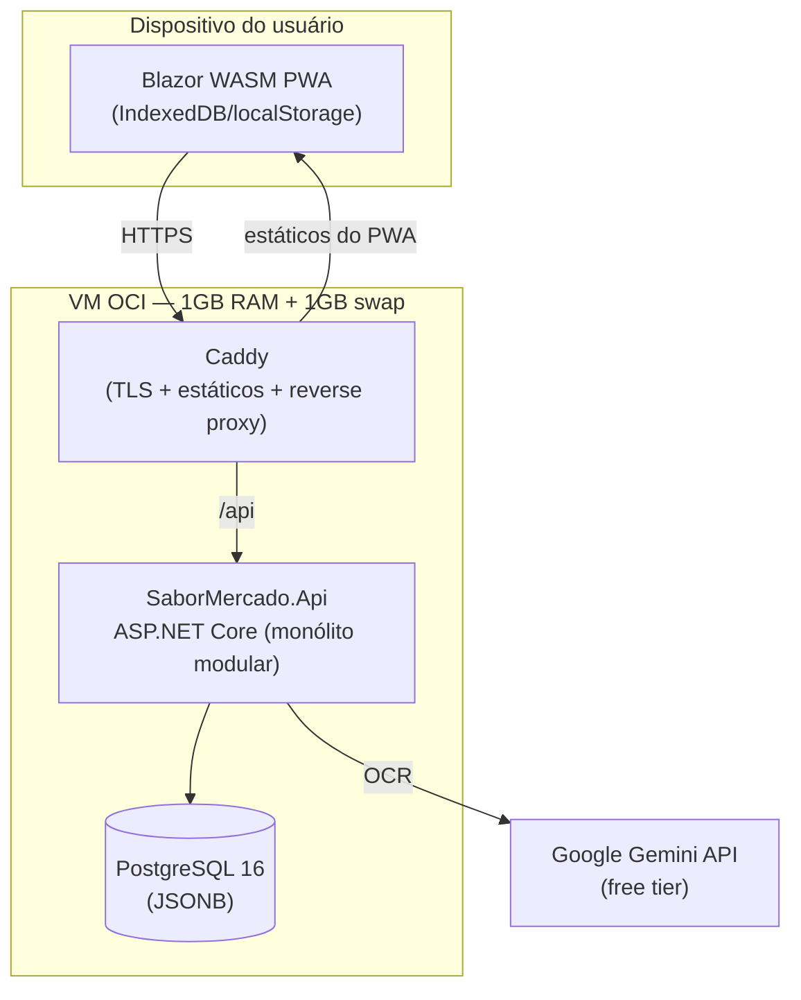

# Arquitetura — Visão Geral

> Arquitetura em duas fases: **Fase 1 (MVP)** cabe na VM OCI de 1GB RAM;
> **Fase 2+** escala para 10.000+ usuários sem reescrita, graças às fronteiras
> de módulo definidas em `docs/domain/domain-model.md`.

## Princípios

1. **Offline-first:** o PWA Blazor WASM funciona sem o backend. O servidor só
   é necessário para OCR, catálogo colaborativo, créditos e conta.
2. **Monólito modular primeiro** (ADR-0003): um único processo ASP.NET Core
   com módulos isolados por contexto. Extração para serviços é uma decisão de
   deploy, não de design.
3. **Stack C#/.NET de ponta a ponta** (Constitution VI): .NET LTS atual,
   ASP.NET Core Minimal APIs, Blazor WebAssembly PWA, EF Core.

## Diagrama de contêineres (Fase 1 — MVP)



## Estrutura da solução (.NET)

```
src/
  SaborMercado.Api/              # Host ASP.NET Core (composição dos módulos)
  SaborMercado.Modules.Recognition/
  SaborMercado.Modules.SharedCatalog/
  SaborMercado.Modules.Rewards/
  SaborMercado.Modules.Identity/
  SaborMercado.Shared/           # Contratos, primitivas (sem regra de negócio)
  SaborMercado.Web/              # Blazor WASM PWA (Shopping + Catalog locais)
tests/
  SaborMercado.UnitTests/
  SaborMercado.IntegrationTests/
  SaborMercado.Web.Tests/        # bUnit
```

Regras de dependência (verificadas em review):
- Módulos não referenciam uns aos outros; comunicação via contratos em
  `Shared` ou eventos in-process.
- `Web` (cliente) só conhece a API HTTP — nunca referencia módulos do servidor.
- Cada módulo possui seu próprio `DbContext` e schema PostgreSQL próprio
  (`recognition`, `shared_catalog`, `rewards`, `identity`) — pré-requisito
  para a extração da Fase 2.

## Distribuição de responsabilidades

| Capacidade                         | Onde roda  | Por quê                                |
|------------------------------------|------------|-----------------------------------------|
| Carrinho, orçamento, alertas       | Cliente    | Instantâneo, offline, custo zero        |
| Catálogo pessoal + histórico       | Cliente    | Privacidade por padrão                  |
| OCR (Gemini proxy)                 | Servidor   | Protege API key, aplica rate-limit      |
| Catálogo colaborativo + validação  | Servidor   | Dado compartilhado, anti-fraude         |
| Créditos / desbloqueios            | Servidor   | Integridade (ledger)                    |

## Fase 2+ (resumo)

Quando os limites da Fase 1 forem atingidos (gatilhos objetivos em
`scale-migration-plan.md`): PostgreSQL gerenciado, Redis para cache e
rate-limiting distribuído, MongoDB para o catálogo colaborativo, múltiplas
instâncias da API atrás de load balancer, e extração dos módulos
Recognition e SharedCatalog para serviços próprios se necessário.

## Documentos relacionados

- [`mvp-infrastructure.md`](mvp-infrastructure.md) — orçamento de memória e deploy na VM OCI.
- [`scale-migration-plan.md`](scale-migration-plan.md) — plano de migração para 10k+ usuários.
- [`ocr-integration.md`](ocr-integration.md) — integração com Gemini e fallback manual.
- [`adr/`](adr/) — decisões arquiteturais registradas.
