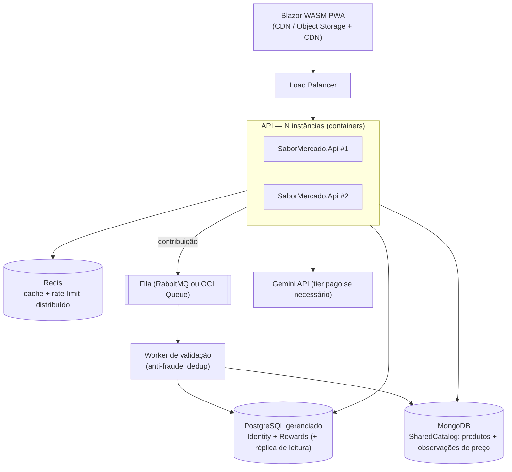

# Plano de Migração para Escala (10.000+ usuários)

> Evolução da Fase 1 (VM OCI 1GB) para uma estrutura distribuída, sem
> reescrita. As fronteiras de módulo (`docs/domain/domain-model.md`) e os
> schemas separados por módulo tornam cada passo incremental e reversível.

## Estado final (Fase 3)

## Papel de cada armazenamento

| Armazenamento        | Dados                                        | Justificativa                                                  |
|----------------------|----------------------------------------------|----------------------------------------------------------------|
| PostgreSQL gerenciado| Identity, Rewards (ledger), RecognitionLog   | Transacional, integridade do ledger exige ACID                 |
| Redis                | Cache do catálogo quente, rate-limit, sessões| Tira leitura repetitiva do banco; rate-limit distribuído       |
| MongoDB              | SharedCatalog (produtos + observações)       | Documentos com atributos variáveis; volume cresce com adoção; leitura por produto/região se beneficia de índices de documento |
| Object Storage + CDN | Estáticos do PWA                             | Tira o tráfego de estáticos das instâncias                     |

## Passos incrementais (cada um é deploy independente)

### Passo 0 — Pré-requisitos (já garantidos na Fase 1)
- Schemas separados por módulo; um `DbContext` por módulo.
- Cache atrás de `IDistributedCache`-ready abstração (Fase 1 usa memória).
- Rate-limit atrás de interface própria (Fase 1: in-process).
- Repositório do SharedCatalog atrás de interface (Fase 1: EF Core/JSONB).

### Passo 1 — Tirar estado da VM
1. PostgreSQL → serviço gerenciado (OCI PostgreSQL / Supabase / Neon).
2. Estáticos do PWA → Object Storage + CDN.
3. A VM original vira só host da API (libera ~250 MB).

### Passo 2 — Horizontalizar a API
1. Containerizar a API (Dockerfile já no repositório desde a Fase 1).
2. Adicionar Redis; trocar `IMemoryCache` → `IDistributedCache` (Redis) e o
   rate-limiter in-process → `RedisRateLimiter`. Mudança de configuração, não
   de código de negócio.
3. 2+ instâncias atrás de load balancer (OCI LB ou Caddy em VM maior).
4. Sessões/antiforgery: Data Protection keys no Redis.

### Passo 3 — Migrar SharedCatalog para MongoDB
1. Subir MongoDB (Atlas M10+ ou OCI).
2. Implementar `MongoSharedCatalogRepository` (mesma interface da Fase 1).
3. Migração de dados: exportar JSONB → documentos (script idempotente,
   executado com dual-write temporário: escreve nos dois, lê do Postgres).
4. Virar a chave de leitura para o Mongo; após 30 dias estáveis, remover o
   dual-write e as tabelas JSONB.

### Passo 4 — Assíncrono e workers
1. Validação de contribuições (anti-fraude, dedup, crédito) sai do request e
   vai para fila + worker dedicado. A API só enfileira e responde `202`.
2. RecognitionLog e métricas via canal assíncrono.

### Passo 5 — Extração de serviços (somente se necessário)
Os módulos já são candidatos a serviços: `Recognition` (CPU/IO bound,
escala independente pela quota do Gemini) e `SharedCatalog` (volume de dados).
Extração = mover o projeto do módulo para um host próprio; contratos HTTP
internos já definidos em `docs/standards/api-standards.md`.

## Metas de capacidade (Fase 3)

| Métrica                       | Alvo                          |
|-------------------------------|-------------------------------|
| Usuários cadastrados          | 10.000+                       |
| Usuários ativos simultâneos   | 1.000                         |
| p95 rotas de leitura          | < 200 ms                      |
| p95 OCR (fim a fim)           | < 3 s                         |
| Disponibilidade               | 99,5%                         |

## O que NÃO muda em nenhuma fase

- O PWA continua offline-first: escalar o backend nunca altera o fluxo local.
- Contratos da API são versionados (`/api/v1`); o cliente antigo continua
  funcionando durante migrações.
- Mensagens de status continuam determinísticas no cliente.
