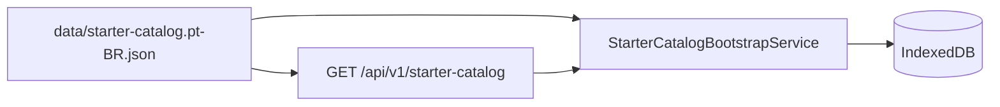

# Catálogo Inicial — Referência

> Catálogo sugerido importado na primeira utilização do app.
> Especificação: [`specs/010-expanded-catalog/spec.md`](../../specs/010-expanded-catalog/spec.md)

## Visão Geral

| Métrica | Valor |
|---------|-------|
| Versão | 3 |
| Produtos | 329 |
| Lojas | 54 |
| Departamentos | 8 |
| Subcategorias | ~279 |
| Arquivo canônico | [`data/starter-catalog.pt-BR.json`](../../data/starter-catalog.pt-BR.json) |
| Comércios (fonte) | [`data/starter-stores.pt-BR.json`](../../data/starter-stores.pt-BR.json) |
| Taxonomia | [`data/product-taxonomy.pt-BR.json`](../../data/product-taxonomy.pt-BR.json) |

## Hierarquia de Categorias

O campo `category` usa três níveis separados por ` > `:

```
Departamento > Categoria > Subcategoria
```

Exemplos:

- `Mercearia > Grãos e Cereais > Arroz`
- `Frios e Laticínios > Queijos > Mussarela`
- `Hortifruti > Frutas > Banana`

## Lojas Padrão

Fonte editável: [`data/starter-stores.pt-BR.json`](../../data/starter-stores.pt-BR.json).
Campos `segment` e `region` são metadados de documentação; o runtime importa apenas `key`, `name`, `city` e `state`.

### Hiper / atacarejo nacional

| Key | Nome |
|-----|------|
| `carrefour` | Carrefour |
| `atacadao` | Atacadão |
| `assai` | Assaí |
| `sams-club` | Sam's Club |
| `big` | Big |
| `tenda-atacado` | Tenda Atacado |
| `total-atacado` | Total Atacado |
| `makro` | Makro |
| `atacadao-dia-a-dia` | Atacadão Dia a Dia |
| `fortatacadista` | Fort Atacadista |

### Supermercados nacionais e GPA

| Key | Nome |
|-----|------|
| `pao-de-acucar` | Pão de Açúcar |
| `extra` | Extra |
| `mercado-extra` | Mercado Extra |
| `minuto-pao-de-acucar` | Minuto Pão de Açúcar |
| `bom-preco` | Bom Preço |

### Regionais — Sudeste

| Key | Nome |
|-----|------|
| `savegnago` | Savegnago |
| `sonda` | Sonda |
| `mambo` | Mambo |
| `st-marche` | St. Marche |
| `guanabara` | Guanabara |
| `prezunic` | Prezunic |
| `covabra` | Covabra |
| `bh-supermercados` | Supermercados BH |
| `supernosso` | Supernosso |
| `bretas` | Bretas |
| `mercantil` | Mercantil |
| `supermercado-sao-luiz` | Supermercado São Luiz |
| `perim` | Perim |
| `spani` | Spani |

### Regionais — Sul

| Key | Nome |
|-----|------|
| `zaffari` | Zaffari |
| `angeloni` | Angeloni |
| `condor` | Condor |
| `rissul` | Rissul |
| `koerich` | Koerich |
| `superpao` | Superpão |
| `peruzzo` | Peruzzo |
| `perini` | Perini |
| `veran` | Veran |
| `unissul` | Unissul |

### Regionais — Nordeste / Norte / Mateus

| Key | Nome |
|-----|------|
| `nacional` | Nacional |
| `hiperideal` | Hiper Ideal |
| `gbarbosa` | GBarbosa |
| `mateus-supermercados` | Mateus Supermercados |
| `armazem-mateus` | Armazém Mateus |
| `mix-mateus` | Mix Mateus |
| `arasuper` | Arasuper |
| `rede-economia` | Rede Economia |

### Centro-Oeste

| Key | Nome |
|-----|------|
| `comper` | Comper |
| `andorinha` | Andorinha |
| `supermercado-mundial` | Supermercado Mundial |

### Discounters e conveniência

| Key | Nome |
|-----|------|
| `dia` | Dia |
| `carrefour-express` | Carrefour Express |
| `oxxo` | Oxxo |
| `ampm` | ampm |

## Como Adicionar Comércios

1. Edite [`data/starter-stores.pt-BR.json`](../../data/starter-stores.pt-BR.json)
2. Regenere: `node scripts/build-starter-catalog.mjs`
3. Valide: `node scripts/catalog-validator.mjs`

## Como Adicionar Produtos

1. Edite [`scripts/build-starter-catalog.mjs`](../../scripts/build-starter-catalog.mjs)
2. Use a função `add(dept, cat, sub, key, name, qty, unit, store)`
3. Regenere: `node scripts/build-starter-catalog.mjs`
4. Valide: `node scripts/catalog-validator.mjs`
5. Incremente `version` no catálogo se houver breaking change

## Distribuição por Departamento

| Departamento | Produtos (aprox.) |
|--------------|-------------------|
| Mercearia | 80 |
| Frios e Laticínios | 40 |
| Bebidas | 35 |
| Hortifruti | 50 |
| Açougue | 34 |
| Padaria e Confeitaria | 21 |
| Higiene e Beleza | 28 |
| Limpeza | 30 |

## Regras de Validação

- Mínimo **300 produtos**
- Mínimo **50 comércios**
- `key` única em kebab-case (sem acentos)
- `defaultStoreKey` deve existir em `stores`
- `quantityUnit` ∈ { `g`, `kg`, `ml`, `l`, `un` }
- Sem preços (usuário informa manualmente ou via OCR)

## Integração



- **API**: `StarterCatalogProvider` em `SaborMercado.Shared`
- **PWA**: importação idempotente via `StarterKey`
- **Offline**: fallback em `wwwroot/data/starter-catalog.pt-BR.json`

## Scripts

| Script | Função |
|--------|--------|
| `scripts/build-starter-catalog.mjs` | Gera o JSON canônico |
| `scripts/catalog-validator.mjs` | Valida schema e regras |
