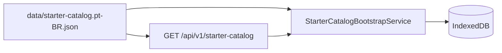

# Catálogo Inicial — Referência

> Catálogo sugerido importado na primeira utilização do app.
> Especificação: [`specs/010-expanded-catalog/spec.md`](../../specs/010-expanded-catalog/spec.md)

## Visão Geral

| Métrica | Valor |
|---------|-------|
| Versão | 2 |
| Produtos | 329 |
| Lojas | 6 |
| Departamentos | 8 |
| Subcategorias | ~279 |
| Arquivo canônico | [`data/starter-catalog.pt-BR.json`](../../data/starter-catalog.pt-BR.json) |
| Taxonomia | [`data/product-taxonomy.pt-BR.json`](../../data/product-taxonomy.pt-BR.json) |

## Hierarquia de Categorias

O campo `category` usa três níveis separados por ` > `:

```
Departamento > Categoria > Subcategoria
```

Exemplos:

- `Mercearia > Grãos e Cereais > Arroz`
- `Frios e Laticínios > Queijos > Mussarela`
- `Hortifruti > Frutas > Banana`

## Lojas Padrão

| Key | Nome | Perfil |
|-----|------|--------|
| `carrefour` | Carrefour | Mix geral |
| `atacadao` | Atacadão | Granel, econômico |
| `pao-de-acucar` | Pão de Açúcar | Premium |
| `assai` | Assaí | Açougue, hortifruti |
| `extra` | Extra | Conveniência |
| `sams-club` | Sam's Club | Atacado premium |

## Distribuição por Departamento

| Departamento | Produtos (aprox.) |
|--------------|-------------------|
| Mercearia | 80 |
| Frios e Laticínios | 40 |
| Bebidas | 35 |
| Hortifruti | 50 |
| Açougue | 34 |
| Padaria e Confeitaria | 21 |
| Higiene e Beleza | 28 |
| Limpeza | 30 |

## Como Adicionar Produtos

1. Edite [`scripts/build-starter-catalog.mjs`](../../scripts/build-starter-catalog.mjs)
2. Use a função `add(dept, cat, sub, key, name, qty, unit, store)`
3. Regenere: `node scripts/build-starter-catalog.mjs`
4. Valide: `node scripts/catalog-validator.mjs`
5. Incremente `version` no catálogo se houver breaking change

## Regras de Validação

- Mínimo **300 produtos**
- **8 departamentos** distintos
- `key` única em kebab-case (sem acentos)
- `defaultStoreKey` deve existir em `stores`
- `quantityUnit` ∈ { `g`, `kg`, `ml`, `l`, `un` }
- Sem preços (usuário informa manualmente ou via OCR)

## Integração



- **API**: `StarterCatalogProvider` em `SaborMercado.Shared`
- **PWA**: importação idempotente via `StarterKey`
- **Offline**: fallback em `wwwroot/data/starter-catalog.pt-BR.json`

## Scripts

| Script | Função |
|--------|--------|
| `scripts/build-starter-catalog.mjs` | Gera o JSON canônico |
| `scripts/catalog-validator.mjs` | Valida schema e regras |
