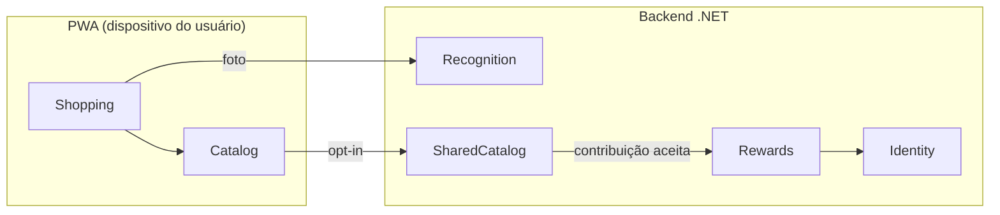

# Modelo de Domínio

> Fonte única de verdade para entidades, fronteiras de contexto e linguagem
> ubíqua. Os módulos do monólito (Fase 1) e os serviços futuros (Fase 2+)
> seguem exatamente estas fronteiras — Constitution, princípio V.

## Bounded Contexts

| Contexto       | Onde roda        | Responsabilidade                                          |
|----------------|------------------|-----------------------------------------------------------|
| **Shopping**   | Cliente (local)  | Sessão de compra, carrinho, orçamento, alertas (F2–F4)    |
| **Catalog**    | Cliente (local)  | Cadastro pessoal de produtos e histórico de preços (F5)   |
| **Recognition**| Servidor         | Proxy OCR (Gemini), parsing, rate-limit, fallback (F1)    |
| **SharedCatalog**| Servidor       | Catálogo colaborativo, validação, anti-fraude             |
| **Rewards**    | Servidor         | Créditos, desbloqueios premium (share-to-unlock)          |
| **Identity**   | Servidor         | Conta leve, autenticação, pseudônimo                      |

Regra: contextos só se comunicam pelos contratos definidos em
`docs/standards/api-standards.md`. Nenhum módulo referencia tipos internos de
outro módulo.

## Entidades e Agregados

### Shopping (cliente, persistido em IndexedDB/localStorage)
- **ShoppingSession** (raiz): `id`, `marketName?`, `budgetAmount?`,
  `startedAt`, `finishedAt?`, `status (Active|Finished|Abandoned)`.
- **CartItem**: `id`, `sessionId`, `productSnapshot` (nome, marca, volume,
  unidade), `unitPrice`, `quantity`, `source (Ocr|Manual|Catalog)`, `addedAt`.
- **BudgetAlertState**: último alerta emitido por sessão (evita repetição).

Invariantes:
- `CartItem.quantity` > 0; total = Σ(`unitPrice` × `quantity`).
- Alertas recalculados a cada mutação do carrinho (ver
  `status-messages.md`).

### Catalog (cliente)
- **Store** (raiz): `id`, `name`, `city?`, `state?`, `address?`,
  `latitude?`, `longitude?`, `createdAt`. Cadastro prévio obrigatório antes
  de vincular produtos e preços.
- **Product** (raiz): `id`, `name`, `brand?`, `quantityValue?`,
  `quantityUnit? (g|kg|ml|l|un)`, `ean?`, `category?`, `notes?`, `storeId`,
  `createdAt`.
- **PriceRecord**: `productId`, `price`, `storeId`, `marketName?`
  (denormalizado), `observedAt`, `source (Ocr|Manual)`.

### Recognition (servidor, stateless + log)
- **RecognitionRequest**: imagem (não persistida), `userPseudonymId?`.
- **RecognitionResult** (DTO): `productName?`, `brand?`, `quantityValue?`,
  `quantityUnit?`, `price?`, `ean?`, `confidence (0–1)`, `rawText`.
- **RecognitionLog** (persistido p/ métricas): timestamps, sucesso/falha,
  latência, motivo de falha — sem a imagem.

### SharedCatalog (servidor)
- **SharedProduct** (raiz): `id`, `normalizedName`, `brand?`, `ean?`,
  `quantityValue?`, `quantityUnit?`, `category?`, `attributes (JSONB)`.
- **PriceObservation**: `sharedProductId`, `price`, `marketId`,
  `observedOn (date)`, `contributorPseudonymId`, `status
  (Pending|Accepted|Rejected)`, `upvoteCount`, `downvoteCount`, `isHidden`.
- **Market**: `id`, `name`, `city`, `state`.
- **ObservationVote**: `observationId`, `voterUserId`, `value (+1/−1)` — um voto
  por usuário por observação.
- **ContributorTrust** (agregado por `pseudonymId`): `trustScore`, contadores de
  votos/contribuições/denúncias, `isRestricted`, `restrictedUntil`.
- **ContributorReport**: `reporterUserId`, `targetPseudonymId`,
  `observationId?`, `reason`, `details?`.

Regras: [`docs/business/community-trust.md`](../business/community-trust.md).

### Rewards (servidor)
- **CreditLedgerEntry**: `userId`, `amount (+/−)`, `reason
  (ContributionAccepted|NewProductBonus|EanBonus|UnlockSpend)`, `refId`,
  `createdAt`. Saldo = soma do ledger (nunca campo mutável).
- **FeatureUnlock**: `userId`, `featureCode`, `expiresAt?`.
- **UserAchievement**: `userId`, `achievementCode`, `unlockedAt` — permanente,
  vinculado à conta (não ao pseudônimo público).

### Identity (servidor)
- **User**: `id`, `email`, `passwordHash`, `pseudonymId (GUID estável)`,
  `createdAt`.

## Linguagem Ubíqua (PT-BR ↔ código)

| Termo de negócio        | Identificador em código |
|-------------------------|-------------------------|
| Sessão de compra        | `ShoppingSession`       |
| Carrinho virtual        | itens da sessão (`CartItem[]`) |
| Meta de orçamento       | `budgetAmount`          |
| Etiqueta de prateleira  | shelf label (entrada do OCR) |
| Observação de preço     | `PriceObservation`      |
| Catálogo colaborativo   | `SharedCatalog`         |
| Crédito                 | `CreditLedgerEntry`     |
| Desbloqueio             | `FeatureUnlock`         |

## Sincronização cliente ↔ servidor

- Cliente é a fonte de verdade dos dados pessoais (Shopping, Catalog).
- Envio ao SharedCatalog é uma **projeção anonimizada**, não uma réplica
  (campos permitidos em `docs/business/share-to-unlock.md`).
- Backup/sync opcional dos dados pessoais (Fase 2) usará o mesmo modelo de
  entidades com `updatedAt` + last-write-wins por entidade.
